# PunchIn

> **Precision time tracking for freelancers** — punch in, punch out, get paid accurately.

PunchIn is a mobile-first, offline-capable Progressive Web App (PWA) for freelancers and independent contractors who need fast, no-friction time tracking. No accounts. No cloud. No subscriptions. Your data lives entirely on your device.

---

## Why PunchIn?

Most time tracking tools are bloated, require an account, or bill you monthly for basic features. PunchIn is the opposite:

- **Instant** — open the app, tap Punch In, you're tracking
- **Private** — all data stored locally in your browser (IndexedDB); nothing ever leaves your device
- **Installable** — works as a PWA; add it to your home screen and use it like a native app
- **Offline-first** — works without an internet connection, always

---

## Screenshots

### All views &nbsp;·&nbsp; Pixel 10 Pro XL (default 1080×2404 @486 PPI · 412×916 CSS px @2.625×)

<p align="center">
  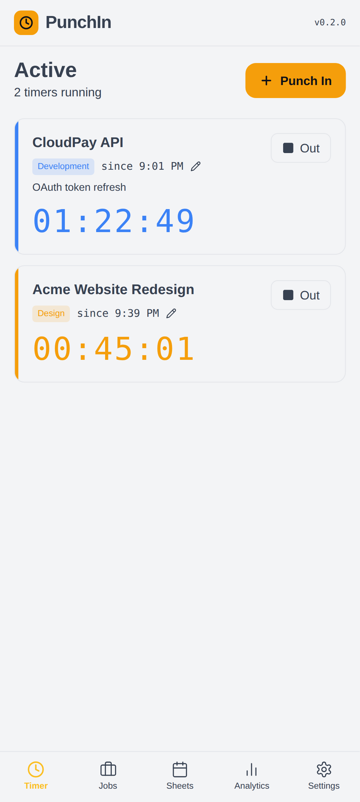
  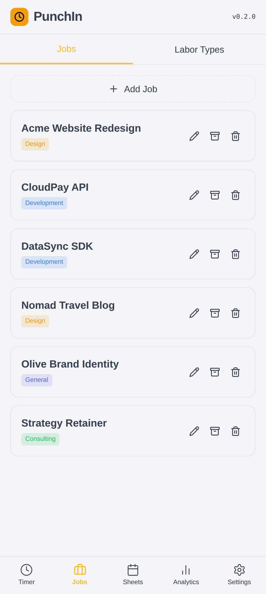
  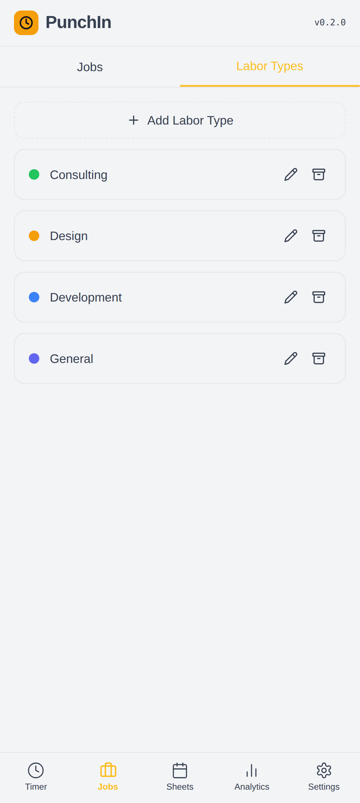
  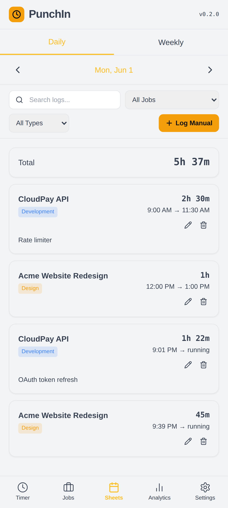
  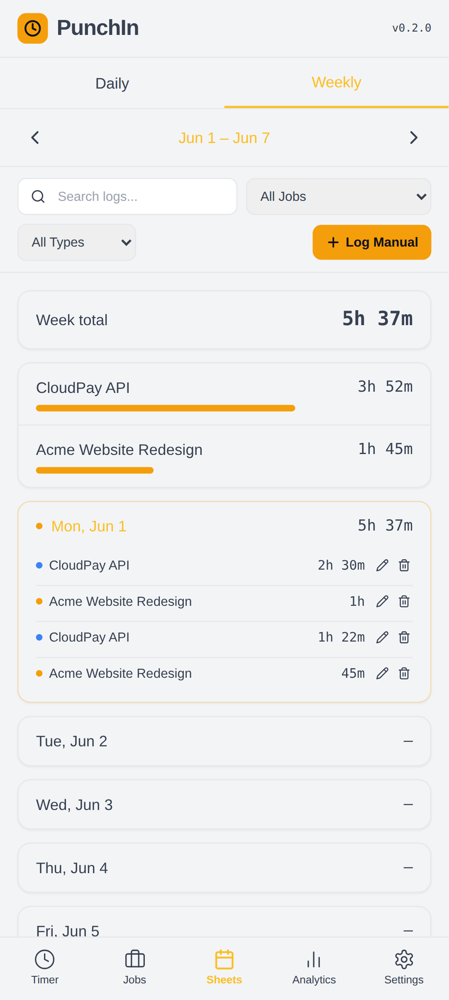
  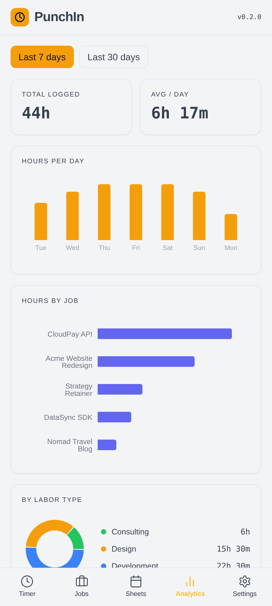
  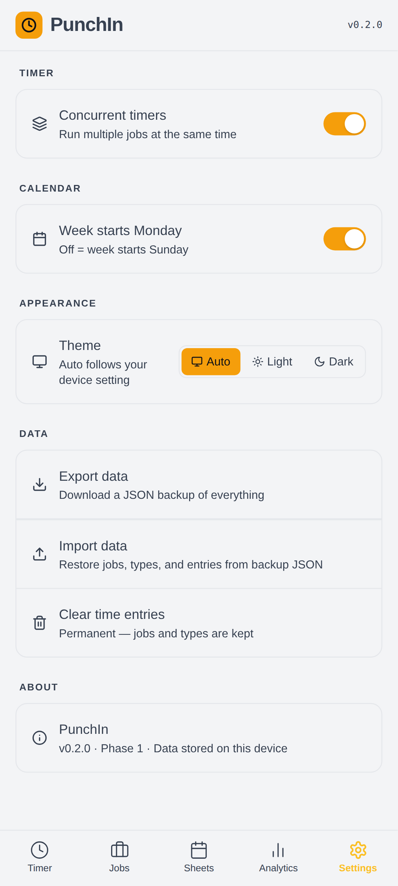
</p>
<p align="center"><sub>Timer &nbsp;·&nbsp; Jobs &nbsp;·&nbsp; Labor Types &nbsp;·&nbsp; Daily Sheet &nbsp;·&nbsp; Weekly Sheet &nbsp;·&nbsp; Analytics &nbsp;·&nbsp; Settings</sub></p>

---

### Scales to every screen size

PunchIn adapts from pocket to desktop without a separate codebase. The bottom-nav shell and card layout reflow naturally across breakpoints.

<table align="center">
  <thead>
    <tr>
      <th align="center">Phone<br><sub>Pixel 10 Pro XL · default 1080×2404 @486 PPI · 412×916 CSS px @2.625×</sub></th>
      <th align="center">Tablet<br><sub>iPad Air 11" M2 · landscape 2388×1668 @2×</sub></th>
    </tr>
  </thead>
  <tbody>
    <tr>
      <td align="center"></td>
      <td align="center">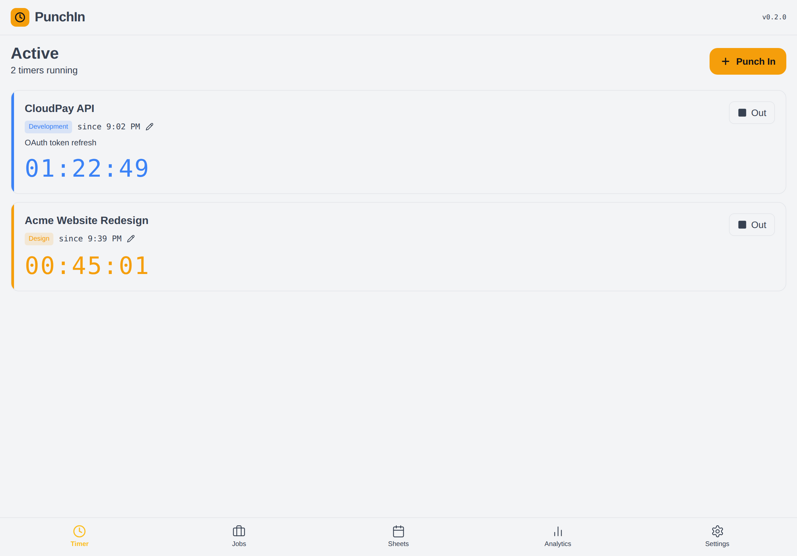</td>
    </tr>
    <tr>
      <td align="center"></td>
      <td align="center">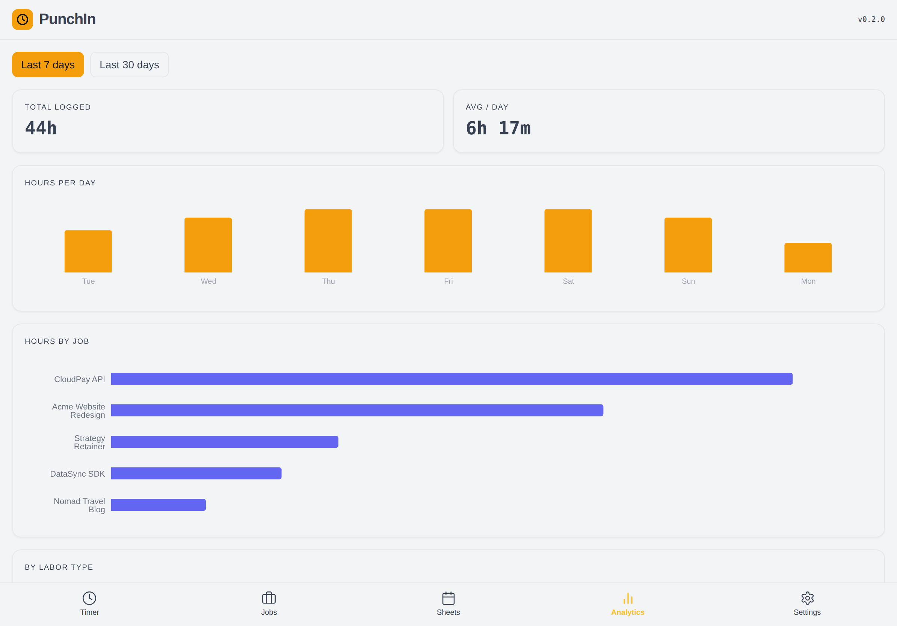</td>
    </tr>
  </tbody>
</table>

<br>

**Desktop · 1920×1080**

<p align="center">
  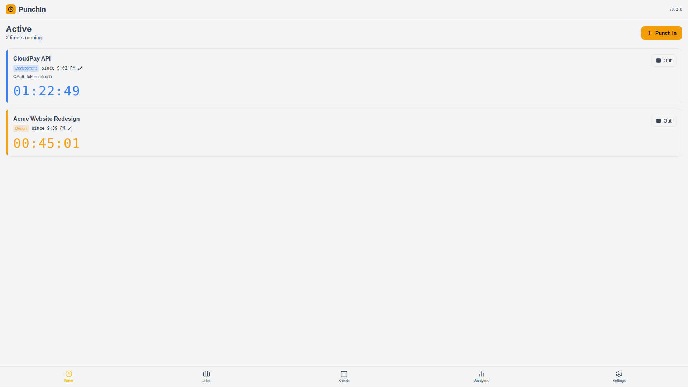<br>
  <sub>Timer view</sub>
</p>
<p align="center">
  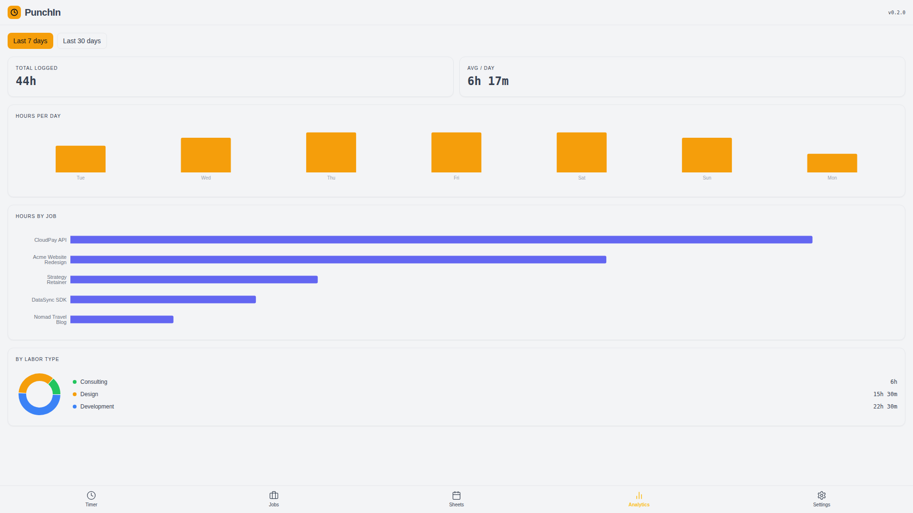<br>
  <sub>Analytics view</sub>
</p>
<p align="center">
  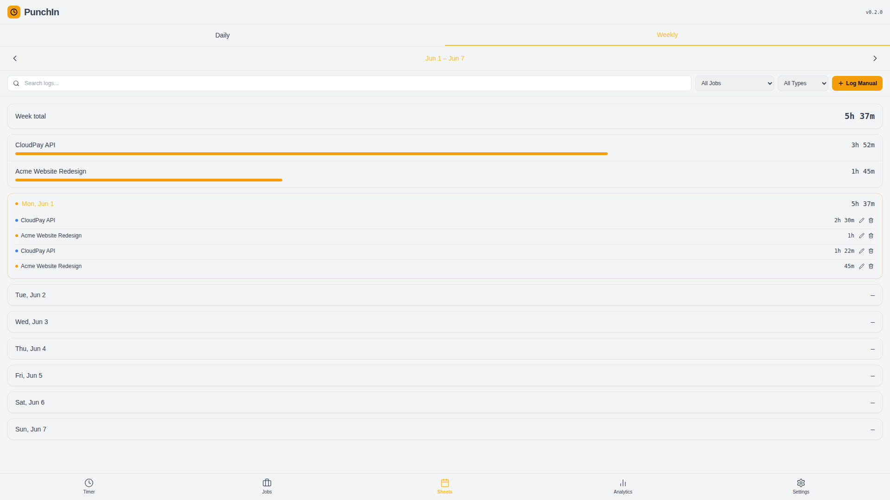<br>
  <sub>Weekly timesheets</sub>
</p>

---

## Features

### Live Timer Dashboard
Start one or more timers across different jobs simultaneously. Each running timer shows the job, labor type, start time, optional notes, and a live elapsed-time counter updated every second. Punch out with a single tap.

### Job & Labor Type Management
Organize your work into **jobs** (client projects) and **labor types** (billable categories like Design, Development, Consulting). Both support color-coded badges for fast visual identification. Archived jobs and types are preserved for historical accuracy — nothing is permanently deleted while entries reference it.

### Timesheets
Review your logged time by **day** or **week**. The weekly view shows a per-job breakdown with proportional bars so you can see at a glance where your time went. Full-text search filters entries by job name, client, labor type, or notes. Navigate between periods with arrows, log past entries manually, and edit or delete any record.

### Analytics
Charts powered by [Recharts](https://recharts.org) give you a visual overview of your workload over the last **7 or 30 days**:

- **Daily bar chart** — hours logged per day
- **Hours by job** — horizontal bar chart sorted by volume
- **Labor type donut** — proportion of time by category

### Settings & Data Portability
- Toggle concurrent timers on or off
- Choose whether your week starts on Monday or Sunday
- Switch between **Auto / Light / Dark** theme (auto follows your OS preference)
- **Export** a full JSON backup of all your data
- **Import** a backup (smart deduplication prevents duplicates)
- **Clear entries** to reset logged time while keeping your jobs and labor types

---

## Tech Stack

| Layer | Technology |
|---|---|
| Framework | React 18 |
| Build | Vite 6 |
| Styling | Tailwind CSS 3 + CSS custom properties |
| Database | Dexie 3 (IndexedDB) |
| Charts | Recharts 2 |
| Date utilities | date-fns 3 |
| Icons | lucide-react |
| PWA | vite-plugin-pwa |
| Hosting | Cloudflare Workers |

---

## Get Started

**[trackmytime.today](https://trackmytime.today)** — open it in any browser, add it to your home screen, and start tracking. No sign-up required.

---

## How It Works

### Data model

All state lives in a local IndexedDB database named `PunchInDB`, managed by Dexie.

| Table | Purpose |
|---|---|
| `entries` | Time records — `punchOut: null` means the timer is still running |
| `jobs` | Client projects; soft-archived via `isActive` / `isDeleted` |
| `laborTypes` | Billable categories with hex color; soft-archived via `isArchived` |
| `settings` | Key-value app preferences |

Soft-deletion is used throughout: records are never hard-deleted so historical entries always retain valid references to their job and labor type.

### State management

No Redux, no global Context. Dexie's `useLiveQuery` hook makes the database reactive — components re-render automatically when data changes. Local React state handles UI concerns (open modals, active tab, search input).

### Theming

Dark and light themes are implemented as CSS custom properties. The default `"auto"` setting tracks `prefers-color-scheme` via a `matchMedia` listener; users can override to force light or dark.

---

## Project Structure

```
punchin/
├── index.html              # App shell, fonts, theme-color meta
├── vite.config.js          # Vite + PWA plugin config
├── wrangler.jsonc          # Cloudflare Workers deployment
├── tailwind.config.js      # Custom font families
└── src/
    ├── App.jsx             # Root: tab state, theme application
    ├── db.js               # Dexie schema, seed data, migrations
    ├── index.css           # CSS variables (dark/light), scrollbar utils
    ├── components/
    │   ├── Layout.jsx          # Fixed header + bottom nav
    │   ├── TimerCard.jsx       # Live timer card (1 s interval)
    │   ├── StartTimerModal.jsx # Punch-in form
    │   └── EditEntryModal.jsx  # Edit active or completed entry
    ├── views/
    │   ├── TimerView.jsx       # Active timers list
    │   ├── JobsView.jsx        # Jobs & labor types CRUD
    │   ├── TimesheetsView.jsx  # Daily/weekly logs + search
    │   ├── AnalyticsView.jsx   # Charts
    │   └── SettingsView.jsx    # Preferences + data management
    ├── hooks/
    │   └── useSettings.js      # Reactive settings hook
    └── utils/
        └── time.js             # Date/time helpers
```

---

## Contributing

### Running locally

```bash
git clone https://github.com/PunchIn-App/punchin.git
cd punchin
npm install
npm run dev       # Vite dev server at http://localhost:5173
npm run build     # production build → dist/
npm run preview   # serve the production build locally
```

### Workflow

1. Fork the repo and create a branch (`git checkout -b feature/your-idea`)
2. Make your changes — see `CLAUDE.md` for architecture conventions and the "What NOT to do" list
3. Test manually in a browser at mobile width (375 px) and at desktop width
4. Open a pull request with a clear description of the change

### Key conventions

- **No router** — navigation is tab-based state in `App.jsx`; this is intentional for PWA standalone mode
- **No backend** — keep all data local; do not introduce cloud sync or authentication
- **Date math** — always use helpers from `src/utils/time.js`; never inline raw `Date` arithmetic
- **Schema changes** — bump the Dexie version number and add an upgrade block in `db.js`
- **Bundle size** — check impact before adding a new dependency; the bundle is intentionally small

---

## License

MIT
